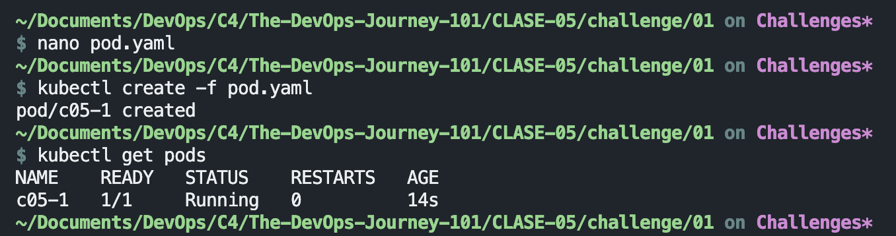
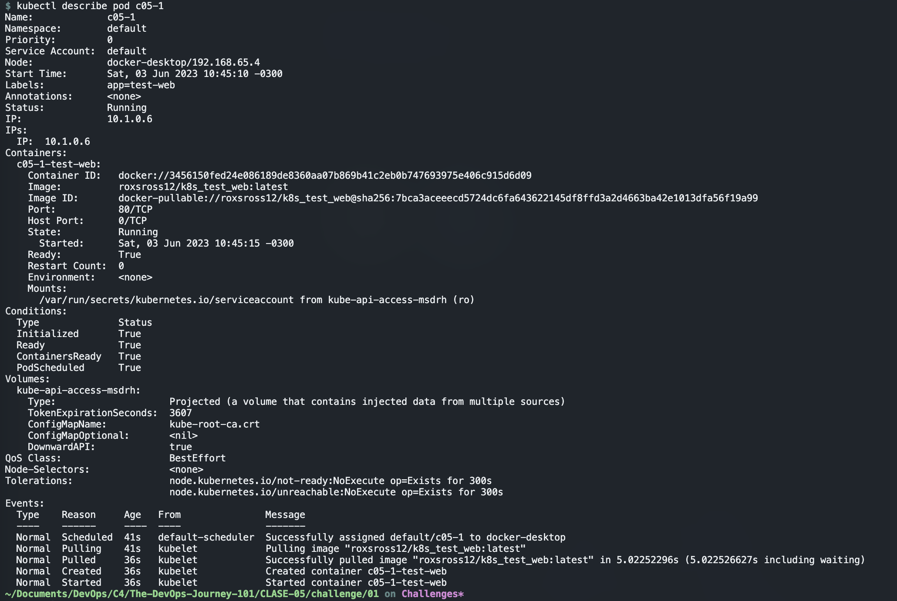
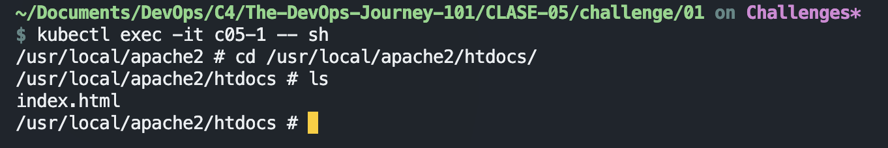
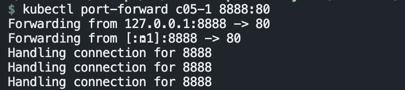
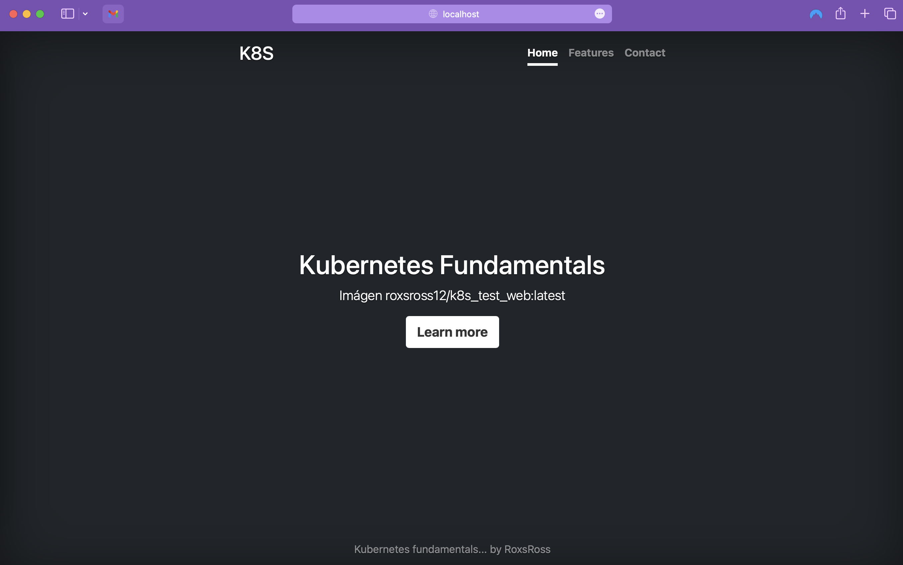
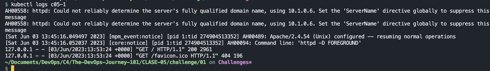

# LAB-01

### Trabajando con Pods

##### 1. Archivo yaml que has creado con la definición del Pod (**pod.yaml**).
#
    apiVersion: v1
    kind: Pod
    metadata:
      name: c05-1
      labels:
        app: test-web
    spec:
      containers:
      - name: c05-1-test-web
        image: roxsross12/k8s_test_web:latest
        ports:
        - containerPort: 80

##### 2. Imagen donde se comprueba que el Pod ha sido creado (**imagen1.png**).

##### 3. Imagen donde se ve la información detallada del Pod (**imagen2.png**).

#### 4. Imagen donde se ve el archivo `index.html` del DocumentRoot (**imagen3.png**).

#### 5. Imagen del navegador accediendo a la aplicación con el `port-forward` (**imagen4.png**).

#### 6. Imagen donde se ve los logs de acceso del Pod (**imagen5.png**).

