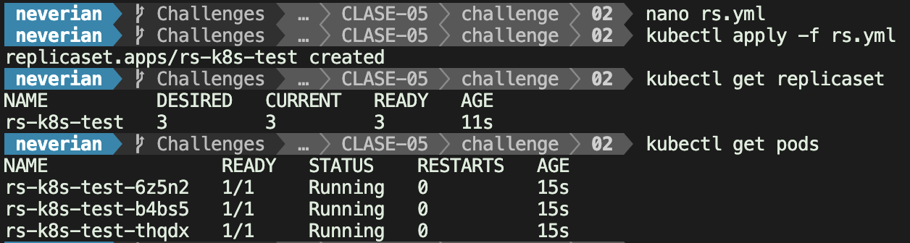
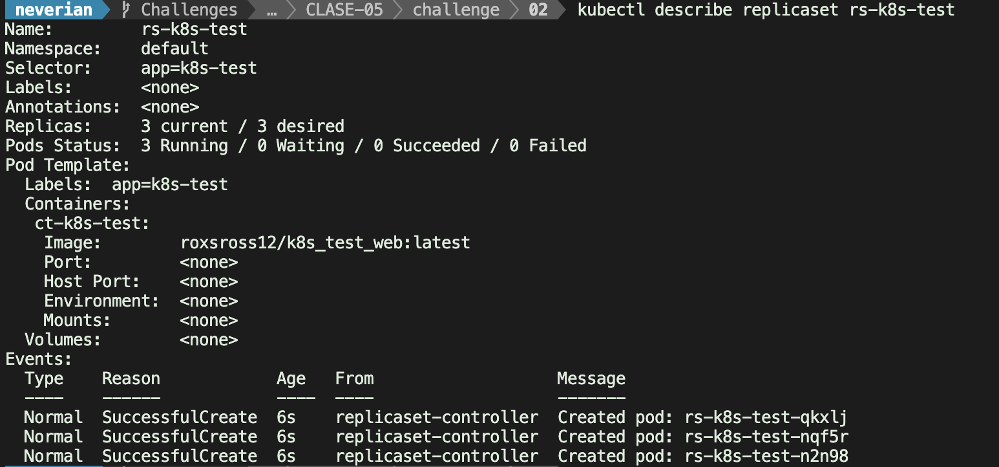
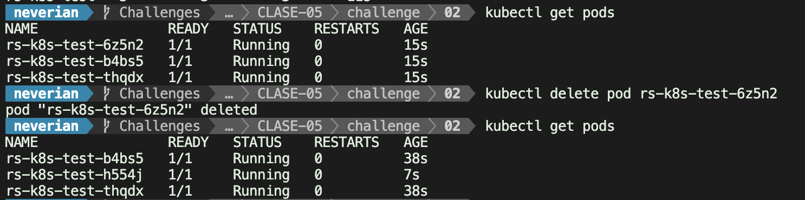
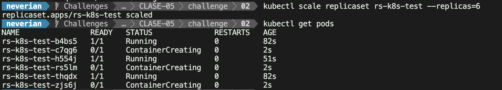

# LAB-02

### ReplicaSet

##### 1. Archivo yaml que has creado con la definición del ReplicaSet (**rs.yml**)
#
    apiVersion: apps/v1
    kind: ReplicaSet
    metadata:
      name: rs-k8s-test
    spec:
      replicas: 3
      selector:
        matchLabels:
          app: k8s-test
      template:
        metadata:
          labels:
            app: k8s-test
        spec:
          containers:
          - name: ct-k8s-test
            image: roxsross12/k8s_test_web:latest
            
##### 2. imagen donde se comprueba que el ReplicaSet y los 3 Pods se han creado (**imagen2.jpg**).

##### 3. imagen donde se ve la información detallada del ReplicaSet (**imagen3.jpg**).

#### 4. imagen donde se ven los Pods que se han creado, después de eliminar uno de ellos (**imagen4.jpg**).

#### 5. imagen donde se ven los Pods que se han creado después del escalado (**imagen5.jpg**).

