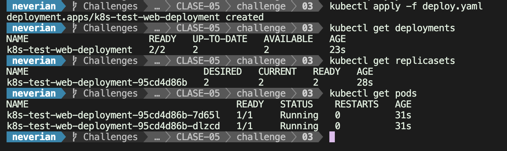
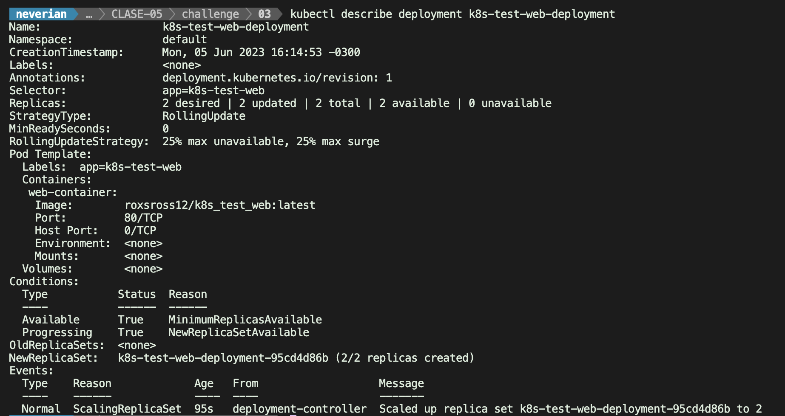
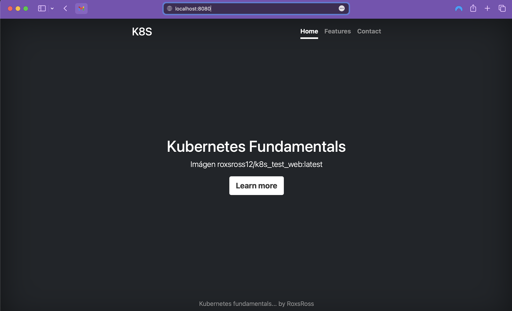

# LAB-03

### Trabajando con Deployments

##### 1. Crear el archivo yaml que has creado con la definición del Deployment (**deploy.yaml**).
#
    apiVersion: apps/v1
    kind: Deployment
    metadata:
      name: k8s-test-web-deployment
    spec:
      replicas: 2
      selector:
        matchLabels:
          app: k8s-test-web
      template:
        metadata:
          labels:
            app: k8s-test-web
        spec:
          containers:
            - name: web-container
              image: roxsross12/k8s_test_web:latest
              ports:
                - containerPort: 80

##### 2. imagen donde se comprueba los recursos que se han creado (**imagen2.jpg**).

##### 3. imagen donde se ve la información detallada del Deployment (**imagen3.jpg**)

#### 4. imagen donde se vea el acceso desde un navegador web a la aplicación usando el `port-forward` (**imagen4.jpg**).

#### 5. imagen donde se vea los logs del despliegue después del acceso (**imagen5.jpg**).

