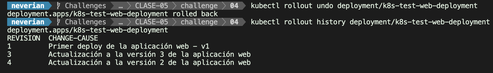

# LAB-04

## Actualización y desactualización de nuestra aplicación

##### 1. imagen donde se vea el acceso desde un navegador web a la version 1 de la aplicación aplicación (**imagen1.jpg**).

##### 2. imagen donde se vea el acceso desde un navegador web a la version 2 de la aplicación aplicación (**imagen2.jpg**).

##### 3. imagen donde se visualice el historial de actualización del despliegue después de actualizar a la versión 2 (**imagen3.jpg**).

#### 4. imagen donde se vea el acceso desde un navegador web a la version 3 de la aplicación (¡¡¡No se visualiza bien la hoja de estilos!!!) 
(**imagen4.jpg**).

#### 5. imagen donde se visualice el historial de actualización después de realizar el *rollback* del despliegue (**imagen5.jpg**).

#### 6. imagen donde se vea el acceso desde un navegador web a la version de la aplicación que queda después de hacer el rollout (**imagen6.jpg**).

